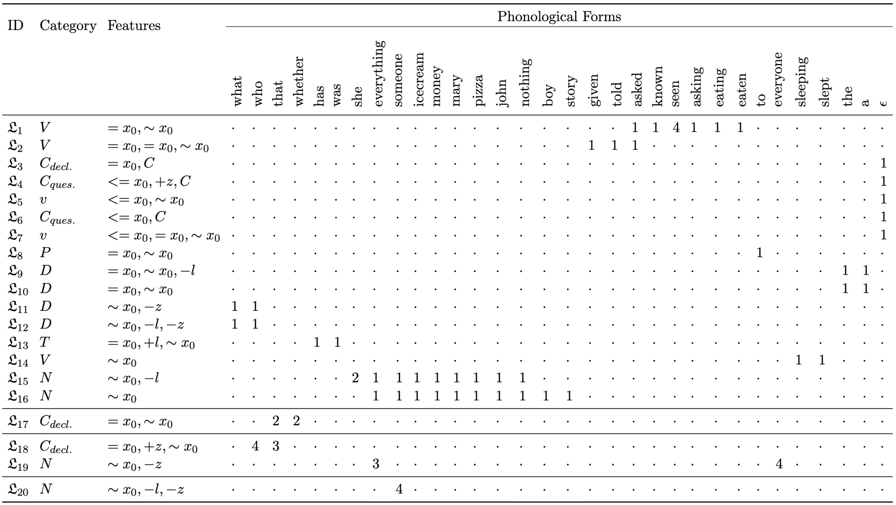
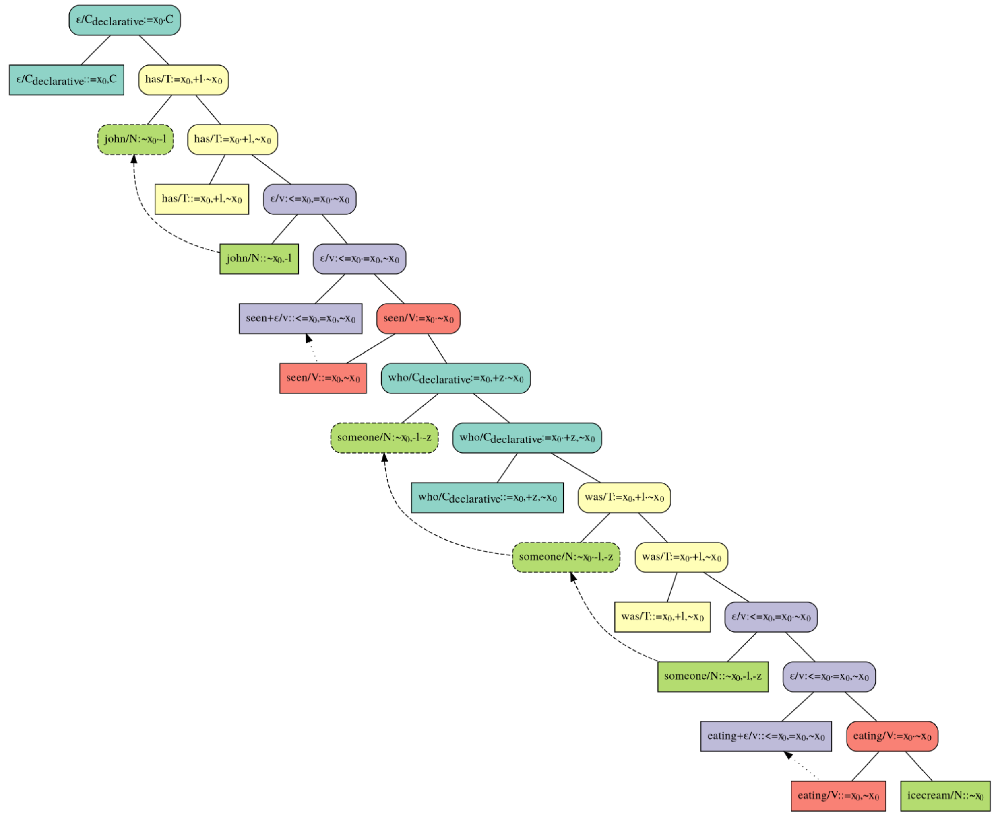

# MGSMT Inference Module

The MGSMT Inference Module, which extends the [MGSMT parser](https://github.com/indurks/mgsmt), includes a procedure for inferring a Minimalist Grammar (MG) lexicon using the the [Z3 SMT-solver](https://github.com/Z3Prover/z3). If you use MGSMT Inference Module, please cite the [publication](https://proceedings.mlr.press/v217/indurkhya23a.html) detailing the inference procedure:

```
@InProceedings{pmlr-v217-indurkhya23a,
  title = {A Procedure for Inferring a Minimalist Lexicon from an SMT Model of a Language Acquisition Device },
  author =  {Indurkhya, Sagar},
  booktitle = {Proceedings of 16th edition of the International Conference on Grammatical Inference},
  pages = {35--58},
  year = {2023},
  editor = {Coste, François and Ouardi, Faissal and Rabusseau, Guillaume},
  volume = {217},
  series = {Proceedings of Machine Learning Research},
  month = {10--13 Jul},
  publisher = {PMLR},
  url = {https://proceedings.mlr.press/v217/indurkhya23a.html}
}
```

## Running the Inference Procedure

To see the inference procedure in action, you can run the accompanying Jupyter Notebooks. E.g. given input consisting of [Primary Linguistic Data](experiment-data/primary-linguistic-data.json) (each entry being a sentence paired with a skeletal representation of meaning), by successively running the four Jupyter Notebooks, the inference procedure will be used to (incrementally) infer an MG lexicon, concluding in the following lexicon:



which in turn can, for example, yield an MG derivation for *"John has seen someone who was eating icecream."*, as shown below:



(See the [associated publication](https://proceedings.mlr.press/v217/indurkhya23a.html) for more details about this example.)

## Requirements

The MGSMT Inference Module requires and has been tested with the following software:
- Z3 v4.8.7 (compiled using Clang 4.0.1)
- Python v3.7.7 (compiled using Clang 4.0.1)
- PyGraphViz v1.5
- IPython v7.12.0
- pdfTeX v3.14159265-2.6-1.40.21 (TeX Live 2020)
    - Compiled with libpng v1.6.37
    - Compiled with zlib v1.2.11
    - Compiled with xpdf v4.02

